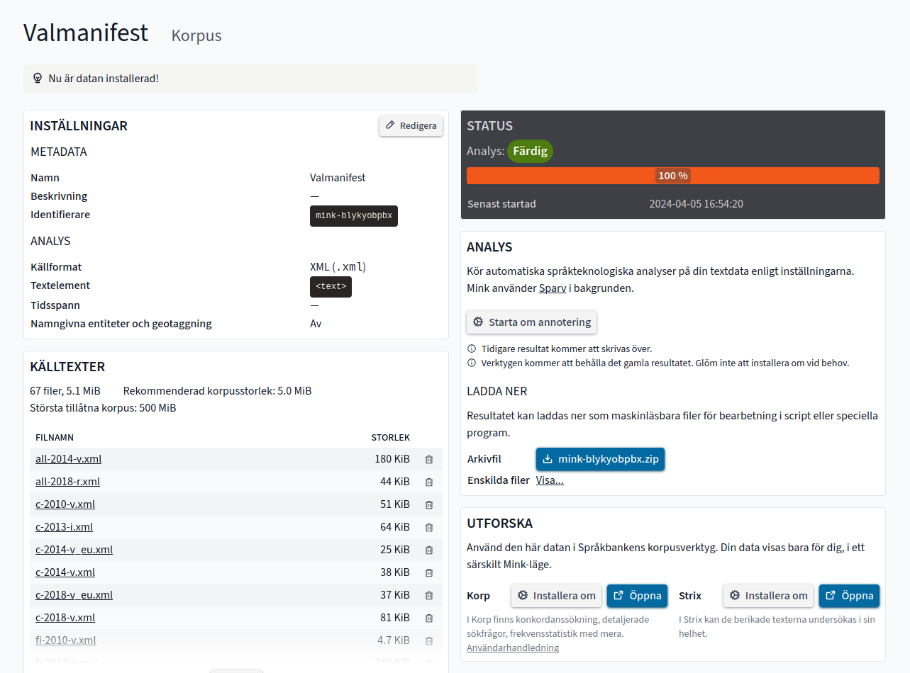

# Mink frontend

With Mink, we are putting Språkbanken's research infrastructure into the hands of the researchers.
You can use Mink to apply our language technology methods on texts that you have collected yourself.
The resulting data can be downloaded or made available through our research tools.

[Use Mink](https://spraakbanken.gu.se/mink/)
– [Language data](https://spraakbanken.gu.se/en/resources)
– [Tools](https://spraakbanken.gu.se/en/tools)



## Code

This repo makes up the frontend at [spraakbanken.gu.se/mink](https://spraakbanken.gu.se/mink/).
It is a [Vue 3](https://v3.vuejs.org/) app using [Vite](https://vitejs.dev/).

### Design patterns

- Single-file components with [`<script setup>`](https://v3.vuejs.org/api/sfc-script-setup.html)
- [Composables](https://vuejs.org/guide/reusability/composables.html) to group state+logic for distinct features
- Utility-first styling with [Tailwind CSS](https://tailwindcss.com/)
- Visualization of API calls:
  1. Wrap async calls in [`spin`](src/spin/spin.composable.js):
     ```js
     spin(loadCorpora(), "Loading corpora", "corpora");
     ```
  2. For markup that might change after the call, wrap it in [`<PendingContent>`](src/spin/PendingContent.vue) to apply animation:
     ```html
     <PendingContent on="corpora"> {{ corpora.length }} </PendingContent>
     ```

### Futher reading

- [Mink API documentation](https://ws.spraakbanken.gu.se/ws/mink/api-doc)
- [Mink project board](https://github.com/orgs/spraakbanken/projects/10)

## Recommended IDE setup

[VSCode](https://code.visualstudio.com/) + [Volar](https://marketplace.visualstudio.com/items?itemName=johnsoncodehk.volar).

VSCode settings:

```json
{
  "editor.codeActionsOnSave": {
    "source.fixAll.eslint": true
  },
  "vetur.validation.template": false,
  "editor.formatOnSave": true,
  "[vue]": {
    "editor.defaultFormatter": "esbenp.prettier-vscode"
  },
  "[javascript]": {
    "editor.defaultFormatter": "esbenp.prettier-vscode"
  }
}
```

## SSL in development

For SB-Auth to allow authentication requests, the dev server must use a hostname matching `*.spraakbanken.gu.se`, and HTTPS must be enabled. See the `server` section in [vite.config.js](vite.config.js). If needed, create certificates with [mkcert](https://mkcert.dev) and refer to them in `.env.local`:

```
DEV_HTTPS_KEY=./local/spraakbanken.gu.se+1-key.pem
DEV_HTTPS_CERT=./local/spraakbanken.gu.se+1.pem
```

## Testing

See:

- [Vue testing guide](https://vuejs.org/guide/scaling-up/testing.html)
- [Vitest API](https://vitest.dev/api/)
- [Vue testing library](https://testing-library.com/docs/vue-testing-library/intro)
