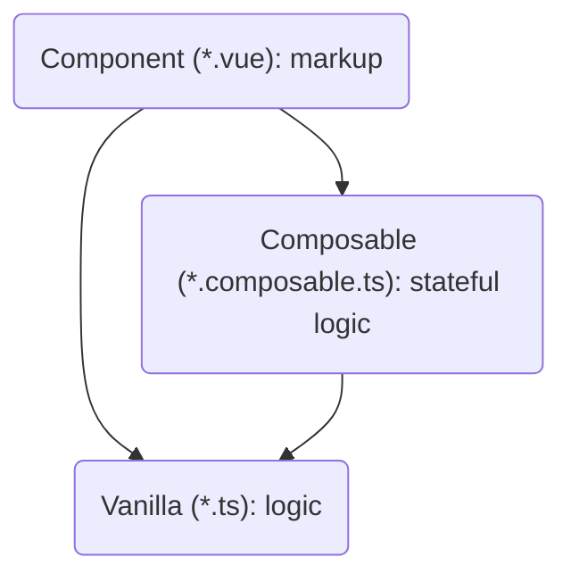

# Style

## Code formatting

Code can be automatically linted with `yarn lint` and formatted with `yarn format`. These use the `.editorconfig` and `.eslint.cjs` files and the `"prettier"` section of [package.json](../package.json).

Committed code must be formatted.

If you can, set up your environment to lint and format automatically, see [DEVELOPMENT.md: Recommended IDE setup](DEVELOPMENT.md#recommended-ide-setup).

## Components

Use single-file components with `<script setup>`, see [Vue docs on \<script setup>](https://v3.vuejs.org/api/sfc-script-setup.html)

## Components → composables → vanilla

Hierarchy:

- Component code (\*.vue) can require other components, composables and vanilla ts files
- Composables (\*.composable.ts) require other composables and vanilla ts files
- Vanilla ts files (\*.ts) can only require other vanilla

Strive to push logic downwards in this hierarchy, towards vanilla ts files.

- Components are more for markup
- Composables are more for stateful logic

## CSS

Use Tailwind CSS classes rather than plain CSS wherever possible.

Omit the `<style>` tag completely if empty.
